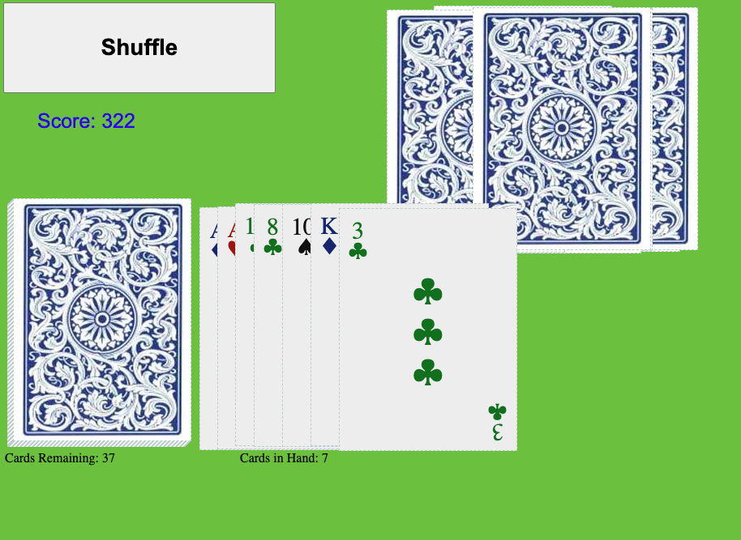

# One Palm Solitaire
This is a one player card game written in JavaScript. 

## History
One day, an old man I was working with at the time, 
showed me a new form of solitaire during our lunch break. 
I tried to recreate the game some time later as a computer game. 
I never got a name for this variation of solitaire, and I'm not even sure I remembered the rules correctly. (I know I added a many extra playable moves, to make the game winnable more often.)

So I named it One Palm Solitaire because in the IRL version you hold the entire deck in your hand and you
flip cards off the top of that deck. Now, you can flip these cards down onto a table, but you can also flip them over to your other hand. So I guess you _could_ call it Two Palm Solitaire. But in this digital version, you'll be using the mouse, and that only takes one palm to use. \
And if you are on mobile... well play in landscape for one thing, in which hand(s) you hold it is up to you. \
...also, I called it Four's Company for a while.

## Game Play
Well much like other solitaires you may have seen or heard about, the objective of this game is to lay down all the cards in your deck. 

Cards move from the **Deck** to the top of the **Spread**. When the cards at the top of the **Spread**
match certain patterns they can be removed and placed into the discard pile. 
If you can discard all the cards, you win!!

There are many patterns that can be matched. They are mainly composed of the top four(4) cards in the **Spread**
but some longer patterns are valid moves. It's sort of complicated to explain it all succinctly here. You best just go and play it.

Any valid moves will be displayed in the upper right of the screen. And when mousing over the **Spread** any 
cards allowed to be discarded will be highlighted. Just click on one of those, and you'll start to figure it out.

I tried to give point values to the moves and even made a gambling mode, but it's all extremely arbitrary and 
could probably use some retooling

## Notes
This code is one big mess and a very early example of my tinkering with JavaScript and CSS. 
I used to use tables for everything.
